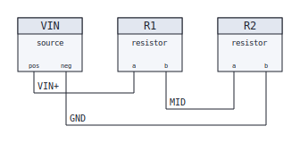

# spec2schematic

Turn a small YAML **wiring spec** into a checked, deterministic schematic. You describe
components and how their ports connect; the tool validates the spec, runs electrical rule
checks, and renders a laid-out drawing as SVG (or DXF). The same input always produces the
same bytes, so every drawing is diffable, testable, and frozen behind a golden gate.

<p align="center">
  
</p>

The image above is not a screenshot. It is [one of the golden files](tests/golden/) the test
suite compares against byte-for-byte, so the README can never drift from what the code emits.

## Quickstart

```bash
pip install -e ".[dev]"

# print the netlist and run electrical rule checks
spec2schematic check examples/divider.yaml

# render a schematic (deterministic: same spec, same bytes)
spec2schematic render examples/divider.yaml -o divider.svg

# geometry lint over the rendered drawing
spec2schematic lint examples/*.yaml

python -m pytest
```

DXF export is an optional extra:

```bash
pip install -e ".[dxf]"
spec2schematic render examples/dol_starter.yaml -o dol_starter.dxf
```

A FastAPI service and browser demo wrap the same core (see
[Service, demo UI & MCP server](#service-demo-ui--mcp-server) below):

```bash
pip install -e ".[dxf,service]"
uvicorn service.main:app --reload
# open http://127.0.0.1:8000
```

## Architecture

```
 spec.yaml
    |
    v
 schema.py ---> Spec: components, ports, nets (+ optional cable grouping)
    |
    v
 erc.py ------> electrical rule gate  (E001..E004, W001; errors block rendering)
    |
    v
 layout.py ---> Drawing: boxes, pins, wire segments, junction dots, labels
    |                     |
    |                     +--> lint.py: geometry lint (L001..L004)
    v
 render_svg.py --> .svg   byte-stable, golden-tested
 render_dxf.py --> .dxf   optional, via ezdxf
```

Both renderers consume the exact same `Drawing`, so SVG and DXF always agree on geometry.
The lint pass also runs on the `Drawing`, not on the output text, so one set of checks gates
every format.

## Spec format

```yaml
name: voltage-divider
components:
  - id: R1
    type: resistor
    ports: [a, b]
  - id: R2
    type: resistor
    ports: [a, b]
nets:
  - name: MID
    connects: [R1.b, R2.a]
```

An endpoint is written `COMPONENT.PORT`. Nets may name a shared `cable`; those nets stay
electrically distinct but are drawn as a single line with a conductor-count label
(see [docs/rendering-notes.md](docs/rendering-notes.md)). Example specs:
a [voltage divider](examples/divider.yaml), a [DOL motor starter](examples/dol_starter.yaml)
control circuit, and a [tank level control](examples/tank_level.yaml).

## Rule checks

Electrical (block or warn before any drawing):

| Code | Severity | Meaning                                           |
|------|----------|---------------------------------------------------|
| E001 | error    | duplicate component id                            |
| E002 | error    | net references a component that doesn't exist     |
| E003 | error    | net references a port the component doesn't have  |
| E004 | error    | net connects fewer than two endpoints             |
| W001 | warning  | a declared port is not connected to any net       |

Geometry (lint over the laid-out drawing):

| Code | Meaning                                             |
|------|-----------------------------------------------------|
| L001 | a wire passes through a component body              |
| L002 | two wire segments overlap collinearly               |
| L003 | a label collides with another label or with a wire  |
| L004 | a pin is drawn but connected to nothing             |

## Service, demo UI & MCP server

`service/` wraps the exact same core (`schema` → `erc` → `layout` → `lint` / `render_*`) in
a small FastAPI app, with a single-file vanilla-JS demo UI served at `/`:

| Endpoint               | Method | Does                                                          |
|------------------------|--------|----------------------------------------------------------------|
| `/`                    | GET    | mini demo UI: paste/load a spec, render it, download the DXF |
| `/api/examples`        | GET    | the repo's example specs (name + YAML)                       |
| `/api/generate`        | POST   | `{"spec": "<yaml>"}` → `{"svg": "...", "lint": [...]}`        |
| `/api/generate/dxf`    | POST   | `{"spec": "<yaml>"}` → DXF file download                      |

ERC errors and malformed YAML come back as `422` with a readable message list, not a stack
trace; specs over 64KB are rejected; generation runs with a timeout so a pathological spec
can't hang a worker. Run it locally:

```bash
pip install -e ".[dxf,service]"
uvicorn service.main:app --reload
python -m pytest tests/test_service.py
```

**Hosted demo:** not deployed yet — see [DEPLOY.md](DEPLOY.md) for the free Render.com
path (Hugging Face Spaces' Docker SDK now requires a paid PRO plan; Static Spaces can't run
a Python backend).

### MCP server

`mcp_server/server.py` exposes the same core as two MCP tools, so any MCP-aware client
(Claude Code, Claude Desktop, etc.) can generate schematics without shelling out to the
CLI: `generate_schematic(spec_yaml)` renders SVG + DXF to a temp directory and returns
their paths plus lint findings; `list_examples()` returns the repo's example specs.

```bash
pip install -e ".[mcp]"
claude mcp add spec2schematic -- python mcp_server/server.py
```

## Testing

The project is developed with heavy test automation: unit tests over every module, CLI
tests, a determinism test that renders in subprocesses under different `PYTHONHASHSEED`
values and requires byte-identical output, and a golden gate: the rendered SVG of every
example is committed and compared byte-for-byte on each run. To change the renderer you
must re-freeze the goldens (`python -m pytest --update-goldens`) and justify the diff in
the commit. CI runs the suite on Python 3.11 and 3.12 and lints every example.

## Build journal — mistakes & turnbacks

An honest log of the wrong turns, kept because the reasons matter more than the fixes.

**I drew a two-conductor cable as two separate lines, and the drawing got worse as it got
more correct.** Each conductor rendered as its own parallel run, which doubled the wire
count of every cable and buried the actual topology in clutter. The turnback was realizing
the drawing and the netlist don't have to use the same representation: the netlist keeps
every conductor as a distinct net (shorting them would be a lie about the circuit), while
the drawing shows one line per cable with a conductor-count label, breaking out at the
connector.

**My first wires went straight through component blocks.** The router connected pin to pin
by the shortest orthogonal path, and the shortest path is frequently through the body of a
component: electrically meaningless, visually wrong, and unreadable on paper. Instead of
patching detours case by case, I changed where wires are allowed to exist: all routing now
lives in a channel below the component row, each net on its own lane, with only vertical
drops from pins into the channel. Wires can no longer cross a body because the geometry
gives them no way to. The lint pass (L001) still checks it, but as a tripwire, not as the
mechanism.

**I cut rails at multiple points before adopting the single clean cut.** When a wire tapped
a shared rail, early output touched the rail wherever it was convenient: multiple contact
points, ambiguous junctions, and drawings that read as if every crossing were a connection.
The convention now is one tap, one junction dot, and a dot only where it is load-bearing: if
removing it would change which nets are connected, it stays; anything else is a short waiting
to be misread. Crossings without dots are just crossings.

**The golden gate came from getting burned by "harmless" rendering tweaks.** Adjust one
layout constant and an unrelated drawing quietly reshuffles, and nothing fails, because
nothing was watching the picture itself. Now the rendered output of every example is frozen
in the repo, tests compare byte-for-byte,
and the update path is deliberately manual: re-freeze, look at the diff, and say in the
commit why the new picture is right. Determinism is what makes this workable: no
timestamps, no floats, no hash-order dependence (there is a test that renders under
different `PYTHONHASHSEED` values and demands identical bytes). An output you can't diff
is an output you can't review.

### Phase 2: service + hosted demo + MCP server

**Added:** a FastAPI service (`service/`) exposing `/api/generate`, `/api/generate/dxf`,
and `/api/examples`, plus a single-file vanilla-JS demo UI at `/`; a `Dockerfile` that reads
`$PORT` if the host injects one and otherwise defaults to 7860; an MCP server
(`mcp_server/`) exposing `generate_schematic` and `list_examples` as tools. All three sit on
top of the existing core without touching it: same `Spec` → `Drawing` → renderer pipeline,
same golden-tested output.

**Run it:** `uvicorn service.main:app --reload`, open `http://127.0.0.1:8000`. Hosted demo
link: see [above](#service-demo-ui--mcp-server) (not deployed yet, deploy steps for
Render.com's free tier in [DEPLOY.md](DEPLOY.md)).

**Another mistake worth keeping:** I wrote the first deploy doc assuming Hugging Face
Spaces' free tier covered the Docker SDK, the way it always has for CPU-basic hardware.
By the time I actually opened the "create Space" page, Docker (and Gradio) Spaces required
a paid PRO plan — only the Static template, which can't run a Python backend, was free.
The lesson isn't "HF changed pricing," it's that I wrote deploy instructions from memory of
how a third-party platform behaves instead of from the platform's page in front of me at
the time of writing. The fix was mechanical (retarget the primary path to Render.com's free
Docker web services, make the Dockerfile honor `$PORT` so the same image works on both), but
the process fix is the one to keep: verify a paid-tier claim against the live UI before it
ships in a doc, don't trust a training-time snapshot of someone else's pricing page.

**A mistake worth keeping:** the service takes a spec as a YAML *string*, but `load_spec`
only reads from a path, so I write the string to a temp file first. My first version used
`tempfile.mkstemp()` and wrote to the returned path with `Path.write_text`, which left the
file descriptor `mkstemp` itself opened still open. `write_text`/`load_spec` then opened
their *own* handles on top of that, and on Windows the subsequent `unlink()` failed with
`WinError 32: file in use by another process`, because Windows refuses to delete a file
while any handle on it is open (Unix just unlinks the directory entry and lets the last
close free it). The fix was one line, `os.close(fd)` right after `mkstemp` returns, before
any read or write touches the path. But it's the kind of bug that's invisible in CI on
Linux and only shows up on the platform the demo actually needs to run on.

## Roadmap

- [x] Spec model + structural validation
- [x] ERC rule checks (E001–E004, W001) + CLI report
- [x] Continuous integration (GitHub Actions, pytest on 3.11/3.12)
- [x] Deterministic SVG renderer with channel routing
- [x] Golden-image test gate (freeze output, justify every diff)
- [x] DXF export via `ezdxf` (optional extra)
- [x] Geometry lint gate (L001–L004) wired into CLI and CI
- [x] FastAPI service + browser demo UI
- [x] MCP server (`generate_schematic`, `list_examples`)
- [ ] Hosted demo pushed live (Render.com free tier)
- [ ] Multi-row placement for larger specs
- [ ] Wire numbering and terminal-strip tables

## License

MIT — see [LICENSE](LICENSE).
